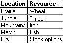
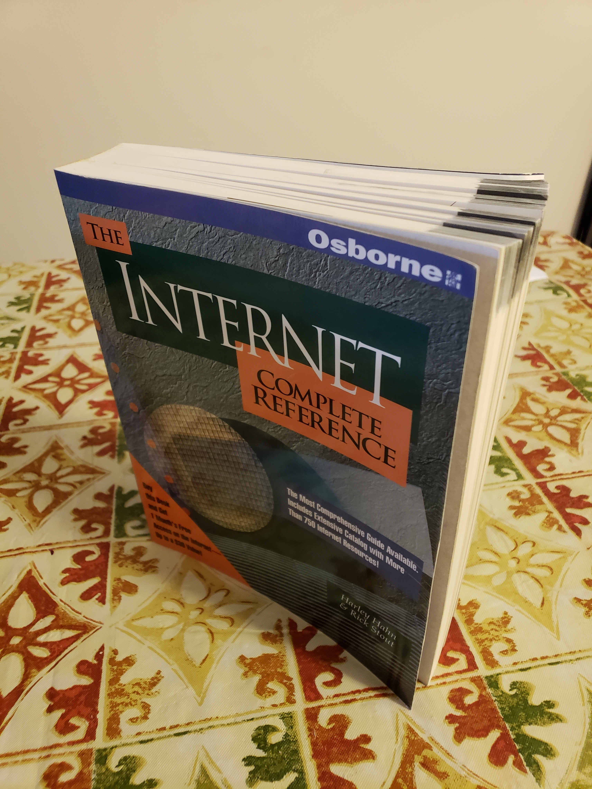

# RULES

## 101 (IMMUTABLE)
All players must always abide by all the rules then in effect, in the form in which they are then in effect. The rules in the Initial Set are in effect whenever a game begins. The Initial Set consists of Rules 101-115 (immutable) and 201-214 (mutable).

## 102 (IMMUTABLE)
Initially rules in the 100's are immutable and rules in the 200's are mutable. Rules subsequently enacted or transmuted (that is, changed from immutable to mutable or vice versa) may be immutable or mutable regardless of their numbers, and rules in the Initial Set may be transmuted regardless of their numbers.

## 103 (IMMUTABLE)

A rule-change is any of the following: (1) the enactment, repeal, or amendment of a mutable rule; (2) the enactment, repeal, or amendment of an amendment of a mutable rule; or (3) the transmutation of an immutable rule into a mutable rule or vice versa.

## 104 (IMMUTABLE)
All rule-changes proposed in the proper way shall be voted on. They will be adopted if and only if they receive the required number of votes.

## 105 (IMMUTABLE)
All proposed rule-changes shall be written down before they are voted on. If they are adopted, they shall guide play in the form in which they were voted on.

## 106 (IMMUTABLE)
No rule-change may take effect earlier than the moment of the completion of the vote that adopted it, even if its wording explicitly states otherwise. No rule-change may have retroactive application.

## 107 (IMMUTABLE)
Each proposed rule-change shall be given a number for reference. The numbers shall begin with 301, and each rule-change proposed in the proper way shall receive the next successive integer, whether or not the proposal is adopted.

## 108 (IMMUTABLE)
Rule-changes that transmute immutable rules into mutable rules may be adopted if and only if the vote is unanimous among the eligible voters. Transmutation shall not be implied, but must be stated explicitly in a proposal to take effect.

## 109 (IMMUTABLE)
In a conflict between a mutable and an immutable rule, the immutable rule takes precedence and the mutable rule shall be entirely void. For the purposes of this rule a proposal to transmute an immutable rule does not "conflict" with that immutable rule.

## 110 (IMMUTABLE)
A player always has the option to forfeit the game rather than continue to play or incur a game penalty. No penalty worse than losing, in the judgment of the player to incur it, may be imposed.

## 111 (IMMUTABLE)
The adoption of rule-changes must never become completely impermissible.

## 112 (IMMUTABLE)
Rule-changes that affect rules needed to allow or apply rule-changes are as permissible as other rule-changes. Even rule-changes that amend or repeal their own authority are permissible. No rule-change or type of move is impermissible solely on account of the self-reference or self-application of a rule.

## 113 (IMMUTABLE)
Votes must be unambiguous. A vote that would be ambiguous is not considered to be a vote. Additional rules may be made to clarify what constitutes ambiguity. 

## 114 (IMMUTABLE)
Server administrators and moderators regulate the server and game. Their responsibilities include the creation of text and voice channels, the designation of which messages go in which channels, the editing or deleting of messages that are inappropriate for the channel that they are in, and keeping track of the state of the game. The server administrator may override the decision of a server moderator, and may grant and revoke moderator status to persons. 

A person is a server administrator if and only if they have the "Administrator" role. A person is a server moderator if and only if they have the "Moderator" role. 

## 115 (IMMUTABLE)
Whatever is not prohibited or regulated by a rule is permitted and unregulated, with the sole exception of changing the rules, which is permitted only when a rule or set of rules explicitly or implicitly permits it.

## 201
Players shall initially alternate in a random order to be determined by the server administrator by the start of the game, taking one whole turn apiece. Players joining the game will have their turn order set to preceed the player that is taking their turn at the time of the player’s joining.  Turns belonging to active players may not be skipped or passed, and parts of turns belonging to active players may not be omitted. All players begin with zero points.

## 202
One turn consists of proposing one rule-change and having it voted on.

## 203
A rule-change is adopted if and only if a simple majority of eligible voters vote for it. 

## 204
An adopted rule-change takes full effect at the moment of the completion of the vote that adopted it.

## 205
Every active player is an eligible voter. Every eligible voter must participate in every vote on rule-changes.

## 206
Active players that have not voted after 36 hours of the start of a vote on a rule-change, that have not made a proposal after 36 hours of the start of their turn, or that have publicly declared that they are no longer active become inactive (i.e. lose their active status). Inactive players that have become inactive through the above methods may become active again by attempting to cast a vote (the vote will be counted as though it was cast when they were active) or by publicly declaring that they are active. An inactive player that has become inactive at least twice in the past 168 hours (one week) may not use the above methods to regain active status.

If a player becomes inactive during their turn, their turn ends immediately. If an inactive player's turn would start, their turn is skipped instead.

## 207
Each player always has exactly one vote.

## 208
Players may change or withdraw their votes by stating their intention to do so. Players may not edit or delete their votes (i.e. alter the voting record). A vote that is edited loses its vote status. 

## 209
Proposals may not be edited after they are submitted for voting. A proposal may be resubmitted up to two times a turn. This restarts the vote on the proposal. 

## 210
If two or more mutable rules conflict with one another, or if two or more immutable rules conflict with one another, then the rule with the lowest ordinal number takes precedence.

If at least one of the rules in conflict explicitly says of itself that it defers to another rule (or type of rule) or takes precedence over another rule (or type of rule), then such provisions shall supersede the numerical method for determining precedence.

If two or more rules claim to take precedence over one another or to defer to one another, then the numerical method again governs.

## 211
If players disagree about the legality of a move or the interpretation or application of a rule, then the active player preceding the one moving is to be the Judge and decide the question. Disagreement for the purposes of this rule may be created by the insistence of any player. This process is called invoking Judgment.

When Judgment has been invoked, the next player may not begin his or her turn without the consent of a majority of the other active players.

The Judge's Judgment may be overruled only by either a unanimous vote of the other active players taken before the next turn is begun or the server administrator within 24 hours of the Judgement. If a Judge's Judgment is overruled, and the turn has not changed since the Judgement was made, then the active player preceding the Judge in the playing order becomes the new Judge for the question, and so on, except that no player is to be Judge during his or her own turn or during the turn of a team-mate.

The state of the game has no bearing on whether the server administrator can or cannot overrule the Judge's Judgement.

The server administrator can only overrule a Judge’s Judgement if the Judgement egregiously conflicts with the rules and would cause lasting damage to the game. A majority vote of the other active players, taken within the 24 hours following the overruling, may nullify the overruling, in which case the original Judgement stands, the original Judge resumes their position as Judge, and all Judgements issued by Judges between the overruling and the nullification of the overruling are nullified.
Unless a Judge is overruled, one Judge settles all questions arising from the game until the next turn is begun, including questions as to his or her own legitimacy and jurisdiction as Judge.

New Judges are not bound by the decisions of old Judges. New Judges may, however, settle only those questions on which the players currently disagree and that affect the completion of the turn in which Judgment was invoked. All decisions by Judges shall be in accordance with all the rules then in effect; but when the rules are silent, inconsistent, or unclear on the point at issue, then the Judge shall consider game-custom and the spirit of the game before applying other standards.

## 212
The state of affairs that constitutes winning may not be altered from achieving n points to any other state of affairs. The magnitude of n and the means of earning points may be changed, and rules that establish a winner when play cannot continue may be enacted and (while they are mutable) be amended or repealed.

## 213
If the rules are changed so that further play is impossible, or if the legality of a move cannot be determined with finality, or if by the Judge's best reasoning, not overruled, a move appears equally legal and illegal, then the first player unable to complete a turn is the winner.

This rule takes precedence over every other rule determining the winner.

## 214
Persons wishing to become players may request to do so publicly. Within 24 hours of the request, if no player has publicly objected or privately objected (to a server moderator or administrator) to a player joining the game, that player will join the game. If a player has objected, a vote is immediately held on whether or not the person joins the game. If there is a majority vote in favor after 24 hours of the start of the vote, that player will join the game.

Persons may not pretend to be multiple players at once. Persons that are found to have done this are banned from the game.

## 301
No more than three (3) players may win the game.  Once any player or group of players wins, the game ends. After the game has ended, no rule changes may be proposed or enacted and no in-game actions may be taken.

## 302
The following are defined as locations:
* Prairie
* Jungle
* Mountains
* Marsh
* City
* Desert

Each player is always in exactly one location. A player may, during their turn, choose to change their location. A player can only perform this action once per turn, and may not use this action to change their location to or from the Desert. Other rules may introduce alternative ways of changing a player's location without coming into conflict with this rule.

Players start out in the City, and their location automatically becomes the City if they do not have any location.

## 304
Each player must create a short bio introducing themselves.

## 305
Players start out with 0 wheat, timber, iron, fish, and stock options. These five values are referred to as "location resources".

Players are either Landowners or not Landowners. A player is a Landowner by default, and loses their Landowner status by having their turn skipped. A player that is not a Landowner regains their Landowner status by gaining location resources via the method described below.

Following the end of their turn, players may choose to gain location resources by rolling 2d6 in the #actions channel. A player that performs this action will then gain either 2 or (X - L) resources, whichever is larger. X is equal to the number that the player rolled, and L is equal to the number of other Landowners in the player's location, unless the player is in the City, in which case L is equal to 0.

Players may roll to gain location resources at any time from the end of their turn to the end of the following turn. Once a player has rolled for a location resource, they cannot roll for a location resource again until another one of their turns has ended.

The location resource that they player gains depends on the location that they are in at the time of their roll. Locations correspond to location resources as follows:

If the location that a player is currently in does not correspond to a location resource, that player will be unable to roll for location resources.

## 306

Players may trade location resources to each other. All aspects of a trade must be public and mutually agreed upon.

A trade may only be performed if both players involved in the trade are in the same location. A player may change their location once every 3 turns.

## 307

Players may choose one profession as an action during their turn. Professions are as follows:

* Blacksmith
* Cook
* Alchemists
* Woodcarver

Players may not exceed one profession. If a player wishes to change professions they must wait a full round past their last pick

#### 307b: Items

Players with professions have the ability to create items that have a one time effect on the game state. After a use the item is expended and is destroyed. An item may not be used on the same turn that it is created. Items may be traded between players if they're in the same location. If an item can be used, any player can be targeted. Items can only be crafted by players of that specific profession.

Blacksmith:
* Axe: Target player rolls an extra d3 when collecting resources if they're in the jungle location. 1 iron and 1 timber create 1.
* Pickaxe: Target player rolls an extra d3 when collecting resources if they're in the mountain location. 1 timber and 1 iron create 1.

Wood carver:
* Fishing Rod: Target player rolls an extra d3 when collecting resources if they're in the marsh location. 1 wheat and 1 fish create 1.
* Hoe: Target player rolls an extra d3 when collection resources if they're in the prairie location. 1 fish and 1 wheat create 1.

Cook
* Bread: Two target players swap locations. 6 wheat and 1 timber create 1.
* Stew: Move target player to the location of the user's choice. 5 fish and 4 wheat create 1.

Alchemist
* Fish Oil: Target player takes their turn after this one (that will be their turn for this round). If a player has already taken their during that current round, then the effect is void. 25 fish, 10 wheat, 2 iron, and 2 timber create 1.
* Gold Flakes: No effect. 5 iron and 3 timber create 1.
* Potion of Cleansing: All effects are removed from target player. 2 Gold Flakes create 1.

## 308

* Players may lay claim to territory in a location once they have ended 3 consecutive turns in said location.

* Each player may have only one claim.

* A player loses their claim if they leave their claim's location for more then one turn without having spent the previous four turns at said location.

* Max of 5 claims per location.

* Claimed territory yields and adition d3 die's amount of resources at no cost.

* Claimed territory yields may be upgraded up to 8 times by an additional d3 dice to the yield roll.

* The cost to upgrade a territory is the previous upgrade's cost plus 20 wood, 15 iron, and 15 wheat. 

## 309

* If a bot or part of a bot was written by any player then the source code that runs on this server must be available to other players.

* Bots can not bias one player over the other unless as part of the rules that govern them

* If a rule requires a bot that has not been finished or needs maintenance then the game should ignore that rule. If any part of the rule does not need the bot then those parts should not be ignored. 

## 310

If, during their turn, a player provides a video which meets the below specifications, that player wins the game. This rule does not preclude other methods of winning the game.

Video Specifications
• The video must include the American actor and filmmaker Daniel Michael DeVito Jr. ("Danny DeVito"). In the video, Danny DeVito's face must be shown and he must be clearly identifiable.

• In the video, someone onscreen must say aloud the following series of words, in order, followed by the username of the player providing the video:

"adaptable whistle flag cling surround young event hall vase sash"

This person's mouth must be clearly visible when saying the words and username, and the words and username must be clearly audible.

• Danny DeVito must appear in the video in-person. He must either visibly acknowledge the person saying the above series of words or say the above series of words himself.

• The video must not be doctored or edited in any way that would change the above conditions. To allow other persons to analyze the video and determine its veracity, 48 hours shall pass between the player providing the video and the provider winning the game. If any player believes to have found evidence of tampering in the video during this time, Judgement shall be invoked to decide whether the video is valid or not. If Judgement is invoked, the player providing the video cannot win via this rule while the judgement is ongoing (i.e. the 48-hour timer is ignored). During the judgement process, the providing player may give further evidence to support the video (e.g. a description of when/where the video was taken, evidence that Danny DeVito and the player were both in that location, etc.) If the providing player is found to have falsified the video, they shall be inactive for an entire round of turns after their turn ends. After the round of turns, the player will be considered active again, and may take their next turn.

## 311

Any person who is found to have written something on this server from more than one account will be kicked from the server and unable to win the game. This includes alternate accounts as well as typing something from someone else's account on the server with or without his or her consent.

## 313

Each player may create a Religion at any time. A player must have and provide a name for their Religion when creating it. A player may be a member (or "follower") of up to one Religion at a time. Players may perform up to one of the following actions during a turn:
* Join a Religion
* Leave a Religion
 
Religions are created with zero Faith. At the end of every turn, all Religions with one or fewer followers are disbanded. Following this, all extant Religions gain 2^(n+1)-1 Faith, where n is equal to the number of followers that that Religion has.

## 315

* A Contract is a document formalizing an agreement between signatories with enforced penalties for failure to follow or complete. 
* All Contracts are posted in the Actions channel under a unique title, and if passed posted in the Changelog.
* Contracts cannot be edited.

* A Contract contains 3 parts to be clearly noted in the document.
    1. Terms. - The written agreement between signatories.
    2. Penalties Clause -  The section of the contract stipulating consequences of failing to follow or complete the contract.
    3. Signatories - Players and their titles who are part of the contract. 

* Signatories need to announce their signing of the specific contract in the actions channel to affirm their agreement to the Contract.
* A Contract cannot effect non signatories.
* Contracts can only enforce legal player actions (a legal action that a player is allowed to make on their own) as penalties.

## 317

When the game is won, the winning player(s) shall receive the book "The Internet -- Complete Reference", written by Harley Hahn and Rick Stout, ISBN 0-07-881980-6, Copyright 1994. A copy of this book is currently in the posession of the player Coconutpies at the time of the proposal of this rule (pictures below). Any further reference to "the book" in this rule refers to the copy described above.

When a player or group of players has won the game, the player(s) must contact Coconutpies about how they could have the book delivered to them. If shipping is required for the winning player(s) to receive the book, the winning player(s) must pay any shipping costs. If multiple players have won, they must come to an agreement about how to divide any shipping costs before the book is shipped.

If multiple players have won the game and

1. it is geographically or logistically infeasible for them to share the book, or
2. they do not wish to share the book,

then the winning players must come to an agreement on who will receive the book (again, before the book is given to any of the players).
If the book is destroyed, stolen, or for any other reason is no longer able to be awarded (at Coconutpies' discretion) when a player has won, this rule is considered null and void.

## 318

At every midnight (Central Time) a bot shall automatically roll 1d4. This modifies the number of stock options that all players have by (X-2)%, where X is the number that that bot rolled. If a player would gain or lose a non-integer number of stock options as a result of this, the gain or loss is rounded away from zero.

Only the first roll that the bot makes on midnight have this effect.

## 319

#### 319a: The Bank
* The Bank is an entity with which players may trade their location resources for Bucks.
* The Bank has an inventory which contains Bucks and location resources.
* To make a transaction with the bank, a player must make a request in the actions channel stating what they are trading with and for.
    * All requested transactions are processed once the turn that the transactions have been made on has been completed.
    * Transactions are processed in the order that they were made. If either party does not have the location resources or Bucks needed for the transaction, that transaction is skipped. After all transactions have been processed, all skipped transactions are processed again, in the order that they were made. This continues until every transaction in an iteration has been skipped, after which they are ignored.

#### 319b: Bucks
* On the passing of this amendment, all players' Bucks will be set to 0, the Bank's Bucks will be set to 100, all of the Bank's location resources will be set to 0, and 1d4 will be rolled 5 times to determine the initial prices at which the Bank sells each location resource.
* At midnight (Central Time) the Bank's Bucks is set to 100, and each price at which the Bank sells each location resource is set to 1d4, with a bot making rolls for each individual location resource's price.
* The price at which the Bank buys a given location resource is 70% of the Bank's selling price for said location resource, rounded down.

#### 319c: The Banker Profession
* "Banker" is a profession, superceding Rule 307.
* A player with the Banker profession in the City gains 1 stock option at the start of a turn if that turn is the (4k)th consecutive turn that that player was of the Banker profession and in the City, where k is a positive integer.
* Bankers can craft the following items:
    * Golden Age: Every active player gains 2 location resources corresponding to their current location. Players that would be unable to roll for location resources do not gain any location resources from this item. 13 stock options create 1.
    * Depression: No player can perform any action that would increase the number of a specific location resource that they have. This effect lasts for 5 turns. 40 stock options creates 1.

## 321

* A crusade targets a location and inhibits players on that location from gaining any resources until each player's turn has passed. 
* Each member of a religion gets 5 of that location's resource if the location is free of crusades, superceeding the previous rule.
* To start a crusade any member of crusading religion will post in Actions their support to start a crusade and their religion. 
* A crusade may not be started if it would cause negative faith.
* A dice of d(# of the total crusading religion's members) is rolled at the end of the turn.
* If (the value of the roll) <= (# of crusade supporters in said religion) the crusade begins at the start of the next turn and 500 Faith is deducted, otherwise the religion is blocked from starting crusades for one turn.

## 327

When a turn ends if any player has more than 250 points and their number of points is a prime number then they win the game. If more than the maximum number of players able to win the game qualify for this condition, then players with higher point totals will be prioritized over players with lower point totals. If still more than the maximum number of players able to win the game qualify, then play proceeds as normal until the end of next turn, at which the check is made again.

At midnight Central Time on March 25, the text of this rule will automatically change to "When a turn ends, if any player has more than [X] points then they win the game. If more than the maximum number of players able to win the game qualify for this condition, then players with higher point totals will be prioritized over players with lower point totals. If still more than the maximum number of players able to win the game qualify, then play proceeds as normal until the end of next turn, at which the check is made again.", where "[X]" will be the highest number of points that a player has in the game at the time of the rules text changing, plus three.

## 329

# 330

Once per turn, active players may post an image containing a corgi in the #corgis channel. At the end of the turn, any player who has posted a corgi picture receives 2 points, provided the picture has not been posted before. No points are awarded for duplicate images. Images created from the same source image are duplicates.

Jactually is the Corgi Lord.

## 331

All proposals that rhyme  
from here-on in time,  
shall give their creator  
a number of points in their favor.

The points to be awarded,  
only by judgement can be thwarted,  
and shall be of count nine  
for every eighth line.  

One may rhyme how they will,  
so long as a pattern holds still.  
And once the proposal is passed,  
may they claim the points cast.

For this rule that will hold soon,  
a gift of an 18 point boon,  
will be given Fenris Wolf, the player,  
aswell as the title of "Rhyme Slayer".

As final point to dictate how this rule goes,  
the majority of the proposal must not be irrelevant prose,  
So let there be a bonanza,  
of some very dope stanza!

## 332

Hell is a location, superceding Rule 302.

When a player leaves a religion, that player is automatically moved to Hell.

## 334

* A player is randomly assigned The Holy Hand Grenade Of Antioch.

* To use the Holy Hand Grenade of Antioch one must follow and preform the actions bellow 
in #Actions.

"First shalt thou take out the Holy Pin, then shalt thou count to three, no more, no less.  
Three shall be the number thou shalt count, and the number of the counting shall be three.  
 Four shalt thou not count, neither count thou two, excepting that thou then proceed to three.  
Five is right out. Once the number three, being the third number, be reached, then lobbest  
thou thy Holy Hand Grenade of Antioch towards thy foe, who, being naught in My sight,  
shall snuff it."

* If used incorrectly the wielder will "snuff it."

* The definition of "Snuff it" for the purpose of this rule is to have their location 
changed to hell and loose 15% of their points.
* The Holy Hand Grenade Of Antioch is tradeable. 
* Once used it is removed from game.

## 337

Gray Goo is a tradable item. At the end of every turn, the number of Gray Goo that players have in their inventory doubles.

When this proposal passes, a random active player receives one Gray Goo.

## 338

#### Praise:

Each member of any religion may once per turn praise the god of their religion. This action gives the religion 10 faith per player that participates. 

#### Praying:

Any player of a religion may pray to their god for any one of the actions listed below on their turn only. This costs 30 of your religions faith.
* An extra 1d3 on resource rolls
* A blessing that protects them from any item that may target them for one round.

## 341

Votes can only affect proposal passing or failure.
Proposals are not allowed to distinguish those who voted for it, those who voted against it, or those who did not vote on it from each other.

* Legal jargon was provided by Crorem, who shall if he chooses recieve the title, "The Loyal Linguist Of Legalese "

## 345

This proposal is made,  
to pass only this.  
That one can trade,  
their points if they wish.  

One cannot trade.  
if the result is debt.  
For a trade to be made,  
in #actions it must be set.  

## 349

A new section Called “Task Board” will be added to the business tab in the discord.  
A task is similar to a quest. Tasks are proposed and voted on through the rules process.  
A task has three parts. A) What the player will be doing. B) How the player will achieve this by the given means available (through discord) C) The reward for the given task upon completion.  
Once passed a task is placed ind the “Task Board” and is active for all players to complete for one round counted from the Task proposers turn.  
A Task is to be outlined as described bellow.

Proposal XXXX: Task–Glorb killer 

Go and destroy the glorbs in the marsh. You will get 10 Glorb brains for doing so.  
To destroy the glorbs the player must roll a d20 and get any number above 13 to spawn a glorb. 13 spowns 1 glorb and each numberical increase in dice outcome will spawn an additional glorb. To defeat a glorb that player must roll 1d6 per glorb and roll a 5 or greater.

## 350

* Players get 2 points for every item they create through an action in #actions.
* The item must have been defined in a rule prior to creation inorder to recieve points.
* Resources are not items.

## 352

One week after this rule comes into effect, the Corgi Lord will choose a picture from the #corgis channel and grant it the "Nice Corg Award". The player who posted the picture is rewarded with 3 points. Only pictures posted after this rule comes into effect may be considered, and the Corgi Lord is not eligible for the prize.

## 358

A player in a current religion with more than 4 players becomes "The Jezus" (this is a title)  
This is determined by random(Discretion of random method is left to the admin)  
If the chosen player is not active it is rerolled with only the active players.

## 359

If a player is inactive for a period of 2 weeks, their status becomes like that of a new player (no religion, no claims, no items, no titles, etc) with the exception that they keep their current points. Timers begin after the passing of this proposal.

## 363

A random active player will recieve a ring. One may bring the ring to a new location called Mordor for 10 points. A player may only enter Mordor by legal game actions. One cannot simply walk/move into Mordor.

## 367

Once the total gray goo reaches a count of 2^169 (number of atoms on earth), the game ends as the earth is consummed by the gray goo. 
The person with the most points wins the game at that point.  
It is believed that at that point gray goo consumes the rest of the universe, collapses to form a singularity, and births a new universe where corgis evolved as the intelligent species.

## 368

A new location is added called “The West”

Any player may travel to this location. Once there, player(s) may not leave until their next turn.  Players may “Duel” other players in “The West”.

Players may not own or claim land in “The West”

#### Duels

A duel master is selected by the person challenged from one of the active players not participating in the duel, both participants must type "Ready", the duel master then posts "GO" in game chat and the first player to send the message "Bang" after the go message wins the duel. Challenged players are obligated to participate. If either player types "Bang" before the "GO" message it is counted as an instant loss for that player.  
If the duel does not take place in the turn that it was called the challenged player loses two items of the winners choice and the duel expires.

The player that wins the duel gets 7% rounded down of target item the losing player owns.

## 373

At any given time, one location will be occupied by the Robber. Players in a location occupied by the Robber cannot roll for location resources. Players that are unable to roll for location resources in this manner can still make a roll as if they were rolling for location resources, subject to the same restrictions on when they are able to do so.

When a player that rolls for location resources or rolls as described above rolls a 7, that player may move the Robber to a location of their choosing.

The Robber starts out in the Desert.

## 375

Once changelog gains a backlog of 5 or more, the game will pause between turns untill the backlog is removed.

## 377

A random word will be generated from an online word generator chosen by the moderator. For every past instance of the word posted by a player in Buisness and Discussion, that player will get 1 point. If no points are allocated then a new word will be generated and the process repeated. One may gain no more then 50 points by this rule.  Banana.

## 379

Roses are red,  
violets are blue,  
i got a proposal  
from me to you!  

Any item you hold  
and any resource too,  
if youre so bold  
can be eaten, true!  

The item is then used  
without it's effect  
and into your hand  
the remains you collect.  

So in conclusion you have  
an item of shit,   
as what goes in, comes out  
and so it is writ.  

Shit has no use,  
except in this,  
one can fling it to another,  
like monkeys if you wish.  

Just be sure that the target,  
is in your location  
Otherwise the distance,  
will be their salvation.  

## 380

On the topic of items  
One may not eat shit  
The game frowns upon that  
And you'll be kicked from it  

One may fling at the Robber  
Five of their shits  
And back to the Desert  
He'll go in a fit  
