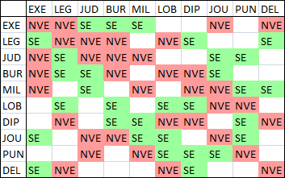

# NOMIC IV RULESET (SHORT FORMAT)
---
## 101 (IMMUTABLE)

All players must always abide by all the rules then in effect, in the form in which they are then in effect. The rules in the Initial Set are in effect whenever a game begins. The Initial Set consists of Rules 101-117 (immutable) and 201-219 (mutable).

## 102 (IMMUTABLE)

Initially rules in the 100's are immutable and rules in the 200's are mutable. Rules subsequently enacted or transmuted (that is, changed from immutable to mutable or vice versa) may be immutable or mutable regardless of their numbers, and rules in the Initial Set may be transmuted regardless of their numbers.

## 103 (IMMUTABLE)

A rule-change is any of the following: (1) the enactment, repeal, or amendment of a mutable rule; (2) the enactment, repeal, or amendment of an amendment of a mutable rule; or (3) the transmutation of an immutable rule into a mutable rule or vice versa.

## 104 (IMMUTABLE)

All rule-changes proposed in the proper way shall be voted on. They will be adopted if and only if they receive the required number of votes.

## 105 (IMMUTABLE)

All proposed rule-changes shall be written down before they are voted on. If they are adopted, they shall guide play in the form in which they were voted on.

## 106 (IMMUTABLE)

No rule-change may take effect earlier than the moment of the completion of the vote that adopted it, even if its wording explicitly states otherwise. No rule-change may have retroactive application.

## 107 (IMMUTABLE)

Each proposed rule-change shall be given a number for reference. The numbers shall begin with 301, and each rule-change proposed in the proper way shall receive the next successive integer, whether or not the proposal is adopted.

When a rule-change is adopted in the proper way, the rule it enacts receives said rule-change’s number.

## 108 (IMMUTABLE)

Rule-changes that transmute immutable rules into mutable rules may be adopted if and only if the vote is unanimous among the eligible voters. Transmutation shall not be implied, but must be stated explicitly in a proposal to take effect.

## 109 (IMMUTABLE)

In a conflict between a mutable and an immutable rule, the immutable rule takes precedence and the mutable rule shall be entirely void. For the purposes of this rule a proposal to transmute an immutable rule does not "conflict" with that immutable rule.

## 110 (IMMUTABLE)

A player always has the option to forfeit the game rather than continue to play or incur a game penalty. No penalty worse than losing, in the judgment of the player to incur it, may be imposed.

## 111 (IMMUTABLE)

The adoption of rule-changes must never become completely impermissible.

## 112 (IMMUTABLE)

Rule-changes that directly or indirectly affect the methods by which the rules are changed are as permissible as other rule-changes.

## 113 (IMMUTABLE)

Rules can change their own text or repeal themselves. Rules cannot make any other changes to the rules unless the explicit authority for such a change is already present.

## 114 (IMMUTABLE)

Votes must be unambiguous. A vote that would be ambiguous is not considered to be a vote. Additional rules may be made to clarify what constitutes ambiguity.

## 115 (IMMUTABLE)

Server administrators and moderators regulate the server and game. Their responsibilities include the creation of text and voice channels, the designation of which messages and actions go in which channels, the editing or deleting of messages that are inappropriate for the channel that they are in, and keeping track of the state of the game. The server administrator may override the decision of a server moderator, and may grant and revoke moderator status to persons.

A person is a server administrator if and only if they have the "Administrator" role. A person is a server moderator if and only if they have the "Moderator" role.

## 116 (IMMUTABLE)

All actions, including voting and rule-change proposals, must occur in the channel or channels that are designated for them. Any action that does not occur in said action’s designated channel is not considered a valid action.

## 117 (IMMUTABLE)

Whatever is not prohibited or regulated by a rule is permitted and unregulated, with the sole exception of changing the rules, which is permitted only when a rule or set of rules explicitly or implicitly permits it.

## 201

Players shall initially alternate in a random order to be determined by the server administrator by the start of the game, taking one whole turn apiece. Players joining the game will have their turn order set to precede the player that is taking their turn at the time of the player’s joining. Turns belonging to active players may not be skipped or passed, and parts of turns belonging to active players may not be omitted. All players begin with zero points.

## 202

One turn consists of proposing one rule-change and having it voted on.

## 203

A rule-change is adopted if and only if a simple majority of eligible voters vote for it.

## 204

An adopted rule-change takes full effect at the moment of the start of the turn following the turn that it was adopted on.

## 205

Every active player is an eligible voter. Every eligible voter must participate in every vote on rule-changes.

## 206

The length of a turn defaults to 24 hours. If the player whose turn it is has made a proposal, the length of the turn is extended by 24 more hours. If, at the 24-hour mark of a turn, all active players have cast an unwithdrawn vote on the current revision of the proposal, and Judgment has not been invoked during said turn, the above extension is revoked and the turn ends immediately.

## 207

An active player becomes inactive (i.e. loses their active status) if any of the following criteria are met:
* It is the active player’s turn, and said player has not made a proposal by the end of their turn
* It is not the active player’s turn, a proposal has been put forward during the turn, and said player has not voted on said proposal by the end of the turn
* The active player has publicly declared that they are now inactive

Players that have become inactive through the above methods may become active again by attempting to cast a vote (the vote will be counted as though it was cast when they were active) or by publicly declaring that they are active.

Players may declare inactivity during their turn. The turn will not end immediately, but any proposal made during the turn is treated as though it does not exist. A player that declares inactivity during their turn cannot become active for the duration of said turn.

If an inactive player’s turn would start, their turn is skipped instead.

## 208

Each player always has exactly one vote.

## 209

Players may change or withdraw their votes by stating their intention to do so. Players may not edit or delete their votes (*i.e.* alter the voting record). A vote that is edited loses its vote status.

## 210

Proposals may not be edited after they are submitted for voting. A proposal may be resubmitted up to two times a turn but may not be resubmitted if the turn has started more than 24 hours ago. Resubmitting a proposal restarts the vote on the proposal.

## 211

If a section of a rule relies on a bot to be implemented to the point where its manual implementation would be infeasible, and there is no such bot, then said rule’s section is void until said bot is functional.

## 212

At the end of a player's turn, 1d6 points are added to their score.

## 213

The winner is the first player to achieve 100 (positive) points.

## 214

If two or more mutable rules conflict with one another, or if two or more immutable rules conflict with one another, then the rule with the lowest ordinal number takes precedence.

If at least one of the rules in conflict explicitly says of itself that it defers to another rule (or type of rule) or takes precedence over another rule (or type of rule), then such provisions shall supersede the numerical method for determining precedence.

If two or more rules claim to take precedence over one another or to defer to one another, then the numerical method again governs.

## 215

If players disagree about the legality of a move or the interpretation or application of a rule, then the active player preceding the one moving is to be the Judge and decide the question. Disagreement for the purposes of this rule may be created by the insistence of any player. This process is called invoking Judgment.

When Judgment is invoked for the first time in a turn, the current turn is extended by 24 hours unless the scheduled end of the turn was already more than 24 hours after Judgment’s invocation. If the turn is extended in this manner, and there are still more than 24 hours left in the turn, a majority of active players may consent to revoke the extension.

The Judge's Judgment may be overruled only by either a unanimous vote of the other active players taken before the next turn is begun or the server administrator before the next turn is begun. If a Judge's Judgment is overruled, then the active player preceding the Judge in the playing order becomes the new Judge for the question, and so on, except that no player is to be Judge during his or her own turn or during the turn of a team-mate.

The server administrator can only overrule a Judge’s Judgment if the Judgment egregiously conflicts with the rules and would cause lasting damage to the game. A majority vote of the other active players, taken before the next turn is begun, may nullify the overruling, in which case the original Judgment stands, the original Judge resumes their position as Judge, all Judgments issued by Judges between the overruling and the nullification of the overruling are nullified, and the server administrator is barred from overruling the Judge for the remainder of the turn.

Unless a Judge is overruled, one Judge settles all questions arising from the game until the next turn is begun, including questions as to his or her own legitimacy and jurisdiction as Judge.

New Judges are not bound by the decisions of old Judges. New Judges may, however, settle only those questions on which the players currently disagree and that affect the completion of the turn in which Judgment was invoked. All decisions by Judges shall be in accordance with all the rules then in effect; but when the rules are silent, inconsistent, or unclear on the point at issue, then the Judge shall consider game-custom and the spirit of the game before applying other standards.

## 216

The state of affairs that constitutes winning may not be altered from achieving *n* points to any other state of affairs. The magnitude of *n* and the means of earning points may be changed, and rules that establish a winner when play cannot continue may be enacted and (while they are mutable) be amended or repealed.

## 217

If the rules are changed so that further play is impossible, or if the legality of a move cannot be determined with finality, or if by the Judge's best reasoning, not overruled, a move appears equally legal and illegal, then the first player unable to complete a turn is the winner.

This rule takes precedence over every other rule determining the winner.

## 218

Persons wishing to become players may request to do so publicly. Within 24 hours of the request, if no player has publicly objected or privately objected (to a server moderator or administrator) to a player joining the game, that player will join the game. If a player has objected, a vote is immediately held on whether or not the person joins the game. If there is a majority vote in favor after 24 hours of the start of the vote, that player will join the game.

Persons may not pretend to be multiple players at once. Persons that are found to have done this are banned from the game.

## 219

Players that are required by the rules to perform an action have a total of 48 hours to perform said action unless otherwise specified. A player that does not perform said action within the allotted 48 hours becomes inactive until either they do perform said action or said action becomes impossible to perform.

## 303

Proposals are not allowed to distinguish those who voted for it, those who voted against it, or those who did not vote on it from each other.

## 304

Upon the event that players do not have an idea for a proposal, on their turn they can invoke a phone a friend action in the actions channel requesting ideas for proposals to submit. This action must be invoked in the first 12 hours of a players turn. Other players can then suggest ideas for a proposal. Other players are limited to submitting 1 suggestion, and these suggestions must be unique from others for this turn. A random suggestion is taken for a proposal, this is done 12 hours after the phone a friend action. If there is a question raised of the “uniqueness” of suggestions, judgement must be invoked, and all but the earliest suggestion will be thrown out. The picked suggestion is posted with an @ to the current player, and they have the option of taking the suggestion word for word, or editing it then posting to the voting channel. If a suggestion is taken word for word suggester gains 3 points upon a passed proposal, or they lose 1 point upon the failure of the proposal.  If a suggestion is taken but not copy and pasted, the suggestor gains 1 point upon success, and nothing upon failure. If at any point the current player comes up with their own idea for a proposal so long as it is unique to all suggestions posted, then that player may scrap all suggestions and propose their own idea.

## 305

The Political Compass is a 801x801 grid. Four ideological groups control the corners of the grid. Pagan Trans-Humanists control the top left corner, (-400, 400), Lovecraftian Eco-Fascists control the top right corner, (400, 400), Raccoon Gamer-Warlords control the bottom left corner, (-400, -400), and Norse Warrior-Shamans control the bottom right corner, (400, -400). An indicator puck begins on (0, 0).

Players are randomly and evenly distributed to each ideology. New players are distributed to a random ideology among those with the least players. Two players can swap teams if both players unambiguously consent to the swap, but players cannot otherwise change ideology. Players can make this swap once per round.

If *x* players in an ideology vote on a proposal, the indicator puck moves two points towards their corner, (or one point if the puck has reached their corner before), both horizontally and vertically. This can happen up to once per turn per ideology. The first time a player proposes a rule-change on their turn, the indicator puck moves one point towards their ideology’s corner, both horizontally and vertically. This can happen up to *x* times per round for a single ideology. In both cases, *x* is equal to the larger of either A) the smallest number *n* such that every ideology has at least *n* active players, or B) 2.

Each ideology has an end-goal, which is activated when the indicator puck reaches their corner. This causes all members of that ideology to gain 35 points and resets the indicator puck.

Each ideology has a power. Members of an ideology must vote in #actions to decide to use their power. The power is only used if at least 2/3rds of the active players in the ideology vote in favor of using it. Powers have a 5-day cooldown. The cost of each power moves the indicator puck the listed distance. Power effects that alter aspects of other powers or mechanics supersede the original descriptions of said powers or mechanics. A player cannot be affected by the same power more than once at the same time.

#### Pagan Trans-Humanists

End-Goal: Upload all players to the cloud via witchcraft, and also, the “cloud” part isn’t a metaphor, there's a massive techno-magic cloud that everyone gets to hang out in.

Power Name: r/pan’s Labyrinth  
Power Description: Force a player to undergo testing for cloud-compatibility.  
Power Cost: (+5, -4)  
Power Effect: When another ideology’s power is used, it has an *x*/*n* chance of backfiring and targeting itself, where *x* is the number of players in said ideology who are currently affected by “r/pan’s Labyrinth,” and *n* is the number of players in said ideology. When a power backfires in this manner, the effect is removed from **all** players.

#### Lovecraftian Eco-Fascists

End-Goal: Summon C’Thussolini to annihilate humanity, thereby restoring balance to nature, and most importantly, have fun while doing it.

Power Name: Sieg-Oh-Hell-No  
Power Description: Force a player to pick up litter at tank-point.  
Power Cost: (-4, -5)  
Power Effect: Targeted player’s ideology’s power has an additional 8 days on its cooldown the next time it is used.  

#### Raccoon Gamer-Warlords

End-Goal: Turn the planet into one big collectivist compound, turn all trash into renewable fuel for Fully Automated Luxury Gay Space Communism, eliminate Notch.

Power Name: Where’d You Get Your Ideology, The Dumpster-Fire Store?  
Power Description: Dox a player on twitter for committing war crimes, forcing them to issue a half-hearted apology.  
Power Cost: (+4, +5)  
Power Effect: The next two times that the target player’s ideology would move the indicator puck towards their corner, it instead moves towards the Raccoon Gamer-Warlords’ corner.

#### Norse Warrior-Shamans

End-Goal: Pillage all of civilization, hoard accumulated wealth, build feudal dystopian society, tell everyone else it’s their faults for not sufficiently pleasing Odin through combat.

Power Name: High-Key Loki Hokey-Pokey  
Power Description: Target player is infected with battle plague, which is like dancing plague, but for murdering the shit out of people.  
Power Cost: (-5, +4)  
Power Effect: Target player’s ideology’s next power usage must target two non-Norse Warrior-Shamans simultaneously, with a 10-day cooldown and 3 times the normal cost, stacking whatever the result is.

## 308

When this rule passes, each player is given 5 random words. (https://wordcounter.net/random-word-generator)

At the end of a player's turn, the player is given 5 random words. If a player has more than 25 words, they must discrard words until they have no more than 25 words.  
Groups or individuals of players may combine words to create a temporary rule in #Actions. Once used in a temporary rule, the player cannot use that word again, unless randomly assigned it again. Temporary rules must contain 3 or more words from a player's randomly given word list.

Temporary rules are not rules, but become rules on the next turn, or if the turn ends in less then 24 hours, the turn after that.

Words may be modified to fit gramatically, but the root word meaning must be retained.  
Punctuation as well as numerical characters 0 to 9 may be used freely.  
The following words may be used without players having them:  
the, be, to, of, and, a, in, that, have, it, for, not, on, with, as, you, do, at, this, but, by, from, they, we, or, will, all, there, their, what, so, if, when, can, no, into, some, can, other, than, then

By default rules created from temporary rules may not superceed other rules, and are numbered 600's and above.  
This rule superceed all previous rules.

This rule has the authority to repeal rules created from temporary rules.  
Changes to this rule, can cause ammendments or removal of rules created from temporary rules.  
Rules created from temporary rules that, either by general consensus or by the Judge's reasoning, are paradoxical, create a situation that has an ambiguous legality, or are too vague to be resolved with confidence are repealed.

A vote may be invoked in #actions to destroy a temporary rule before it becomes a rule. Once invoked, players have untill the end of the next day (24-48hrs) to vote. At the end of the time period (midnight), if a 65% majority agree, the temprory rule is destroyed, else the temproary rule becomes a rule at the end of the current turn.

## 309

All players have an individual emoji list. Once every round, players can add, swap, or remove an emoji from their emoji list by declaring so in #actions. All emojis in a player's emoji list are added at the end of said player's name.

Players must have at least one emoji in their emoji list, and are required to add an emoji to their emoji list if it is empty. Players cannot remove an emoji from their emoji list if doing so would cause their emoji list to become empty.

## 312

If a player, as an individual, proposes a temporary rule that is a quote from a work by Shakespeare, then that player receives five (5) points. The entire rule must be a quote.

## 314

#### Battleship:  
Each player will have their own 10x10 grid that they have to place 5 ships. Horizontal coordinates are the first 10 letters of the alphabet, and vertical are 1-10  
1. Carrier with size 5  
2. Battleship with size 4  
3. Destroyer with size 3  
4. Submarine with size 3  
5. Patrol Boat with size 2

Each of these ships has a width of 1 and a length of its size. They can be oriented any way so that it takes up consecutive grid spots equal to the size of the ship. Each player must submit their ship positions before they can participate in the bombing of other players. Ships may touch, but cannot occupy the same grid square as another.

Each turn players who have placed their ships may bomb another player by calling out their name and the grid coordinates they are bombing. After bombing, a current board is displayed with X's in bombing locations without a ship, and O's where a bomb hit a ship.

If a player places their ships following the first day of Battleship being active, that players grid system is randomly bombed the number of turns since the start of battleship multiplied by 4. Players can bomb twice per turn.

When a player no longer has a ship that hasnt been sunk, that player has lost the game of battleship. Players who have lost can no longer bomb other players. When a final player of all active players is alone with floating ships that player gains 10 points. 

Upon conclusion another game of battleship begins.

## 316

Whichever active player has the fewest points at the conclusion of the game must, as punishment for their poor performance, craft a self deprecating meme, made identifiable by using a photograph of themselves, or copy of their profile picture. The meme must show that the player understands that they lost, and show some level of shame and embarrassment. If the player fails to submit the meme within 72 hours of the conclusion of the game, the meme will be made for them by @Lovergirls Precinct, and will be made *Extra Savage*.

## 317

An action is a direct change to the state of the game. An action can be directly player-initiated or created as the result of an ability.

An ability is a property that each player may or may not have. Abilities create actions depending on what triggers that the ability has. Actions created by an ability are treated as though they were initiated by the originator of said ability.

An action is either an inalienable action or an actionable action. Actionable actions are further divided into immediate actionable action and delayed actionable actions. Abilities have the same classification. An ability of any given type will create actions with the corresponding type.

Action stacks are stacks that delayed actionable actions are pushed on to, popped off from, or created in. Only delayed actionable actions may go on action stacks. If at any point a delayed actionable action on an action stack ceases to be a delayed actionable action, it is removed from its action stack. If the former delayed actionable action is still an action, it is simultaneously put into action.

When an action exerts its stated effect on the game, that action is said to be "put into action".

An inalienable action or an immediate actionable action is put into action the moment it is performed or created, and is irreversible save for Judgment that it was performed or created illegally. A delayed actionable action is pushed onto a specific action stack when it is performed or created. If an action stack and all of the actions that it contains have been unmodified for four consecutive hours, the action stack will pop actions until either a new action has been placed onto said action stack or said action stack is empty, at which point it is deleted. Actions popped in this manner are put into action unless they are blocked or don't meet their prerequisites at the time they are popped. Popped actions occur consecutively.

If an action has a cost, said cost must be paid to perform said action. Costs to perform an action are paid the moment said action is performed and are not part of the action itself. Paying a cost to perform an action is itself an immediate actionable action.

While on its action stack, a delayed actionable action may be blocked, removed, copied, or modified by other actions that target said delayed actionable action.

* When an action that blocks a target delayed actionable action is put into action, the target action is blocked
* When an action that removes a target delayed actionable action is put into action, the target action is removed from its action stack.
* When an action that copies a target delayed actionable action is put into action, a copy of the target action is pushed onto a specific stack. The copy of the action is identical to the target action at the time that it was copied, save that it is treated as though it was performed by the player who performed the actions that copied the action that the copy of the action was copied from. 
* When an action that modifies a target delayed actionable action is put into action, the target action is modified as the targeting action specifies, keeping both its action stack and its placement on its action stack.

Actions may not target themselves. If an action that is put into action would target an action not on its action stack, it instead does nothing.

By default, performing or creating a delayed actionable action creates a new action stack and pushes said action onto it. A player can choose to push a newly-performed action of theirs on top of a preexisting action stack by specifying that they are doing so. Stating that an action is going on the same stack that some specific action is or was on is sufficient specification.

Performed or created actions that target a specific action automatically go on the same action stack as said specific action, any specification to the contrary notwithstanding. If an action targets actions on multiple action stacks, all action stacks containing action that said action targets are merged, and said action is pushed onto the merged stack. Actions in the merged stack are sorted chronologically, with the action created most recently on the top of the action stack and the action created least recently on the bottom of the action stack.

Copied delayed actionable action are put onto the same stack that they would be were the copied delayed actionable action a performed delayed actionable action, with the exception that the player who copied the copied delayed actionable action cannot choose to push said copied delayed actionable action onto an action stack with no action that said copied delayed actionable action targets.

All actions and abilities defined or regulated by the Initial Set (i.e. actions defined or regulated by any rule with a rule number less than 300) are classified as inalienable, while all other actions and abilities are classified as actionable. All actionable actions are immediate actionable actions unless otherwise stated, and all actionable abilities are immediate actionable abilities unless otherwise stated.

## 318

Players may request a custom emoji on their turn in #actions to be added to the list of usable emojis in this Nomic discord. This is done my stating "I would like this image to be added as an emoji" followed by the image posted in #actions

## 319

A Type is a property that may belong to a in-game entity or an action. Actions may have up to one Type. Non-action entities may have up to two Types. An entity or action that has at least one Type is said to be Typed.

The list of Types is as follows:

* Executive
* Legislative
* Judicial
* Bureaucratic
* Military
* Lobbyist
* Diplomat
* Journalist
* Pundit
* Delegate

Any given Type is either super effective, not very effective, or normally effective against any other given type. By default, one Type is normally effective against a second Type. The Type Chart, displayed below, indicates the effectiveness of the first type (left) against the second type (top):

Types bestow their effectiveness properties on the entities that have them; a Typed action targeting a Typed entity with one Type where the action's Type is super effective against entity's Type is considered to be super effective against the entity itself, and likewise for not very effective Types.

If a Typed entity with two Types is targeted by a Typed action, and the action's Type is super effective against one of the entity's Types but not very effective against the other, said action is to be considered normally effective against said entity. Similarly, if the action's Type is super effective against both of the entity's Types, said action is to be considered super super effective against said entity, and if the action's Type is not very effective against both of the entity's Types, said action is to be considered very not very effective against said entity.