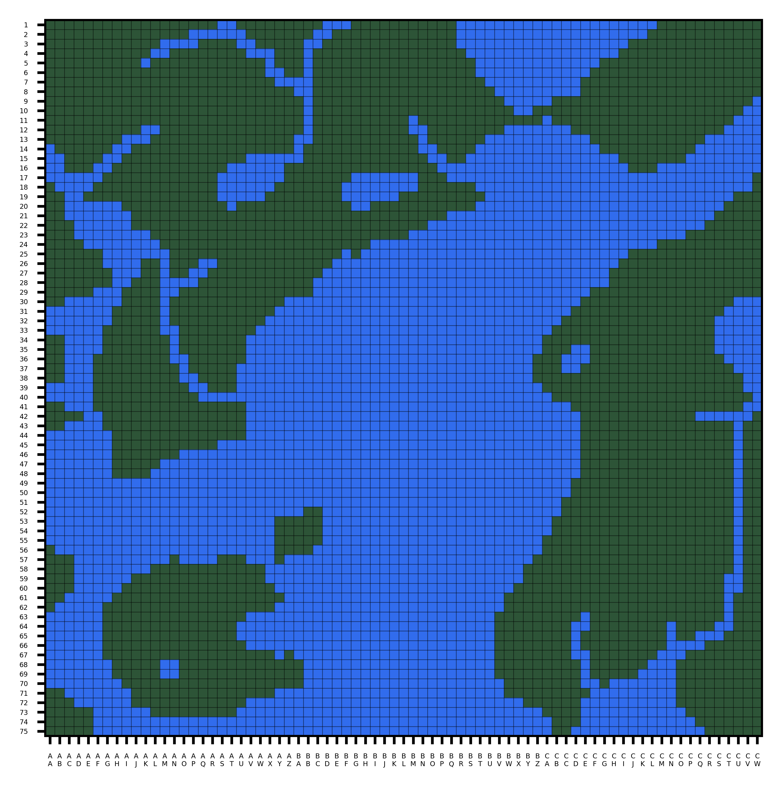
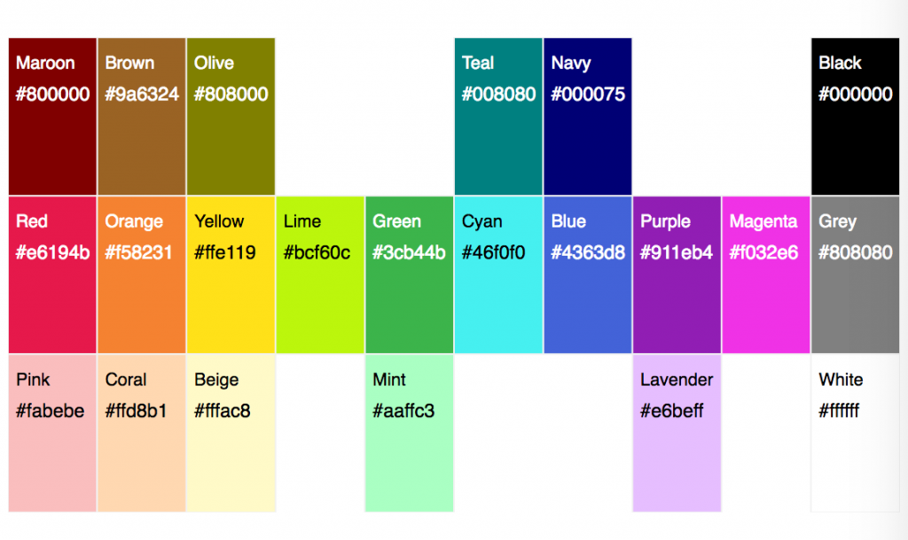

# RULES

## 101 (IMMUTABLE)

All players must always abide by all the rules then in effect, in the form in which they are then in effect. The rules in the Initial Set are in effect whenever a game begins. The Initial Set consists of Rules 101-115 (immutable) and 201-216 (mutable).

## 102 (IMMUTABLE)

Initially rules in the 100's are immutable and rules in the 200's are mutable. Rules subsequently enacted or transmuted (that is, changed from immutable to mutable or vice versa) may be immutable or mutable regardless of their numbers, and rules in the Initial Set may be transmuted regardless of their numbers.

## 103 (IMMUTABLE)

A rule-change is any of the following: (1) the enactment, repeal, or amendment of a mutable rule; (2) the enactment, repeal, or amendment of an amendment of a mutable rule; or (3) the transmutation of an immutable rule into a mutable rule or vice versa.

## 104 (IMMUTABLE)

All rule-changes proposed in the proper way shall be voted on. They will be adopted if and only if they receive the required number of votes.

## 105 (IMMUTABLE)

All proposed rule-changes shall be written down before they are voted on. If they are adopted, they shall guide play in the form in which they were voted on.

## 106 (IMMUTABLE)

No rule-change may take effect earlier than the moment of the completion of the vote that adopted it, even if its wording explicitly states otherwise. No rule-change may have retroactive application.

## 107 (IMMUTABLE)

Each proposed rule-change shall be given a number for reference. The numbers shall begin with 301, and each rule-change proposed in the proper way shall receive the next successive integer, whether or not the proposal is adopted.

## 108 (IMMUTABLE)

Rule-changes that transmute immutable rules into mutable rules may be adopted if and only if the vote is unanimous among the eligible voters. Transmutation shall not be implied, but must be stated explicitly in a proposal to take effect.

## 109 (IMMUTABLE)

In a conflict between a mutable and an immutable rule, the immutable rule takes precedence and the mutable rule shall be entirely void. For the purposes of this rule a proposal to transmute an immutable rule does not "conflict" with that immutable rule.

## 110 (IMMUTABLE)

A player always has the option to forfeit the game rather than continue to play or incur a game penalty. No penalty worse than losing, in the judgment of the player to incur it, may be imposed.

## 111 (IMMUTABLE)

The adoption of rule-changes must never become completely impermissible.

## 112 (IMMUTABLE)

Rule-changes that affect rules needed to allow or apply rule-changes are as permissible as other rule-changes. Even rule-changes that amend or repeal their own authority are permissible. No rule-change or type of move is impermissible solely on account of the self-reference or self-application of a rule.

## 113 (IMMUTABLE)

Votes must be unambiguous. A vote that would be ambiguous is not considered to be a vote. Additional rules may be made to clarify what constitutes ambiguity. 

## 114 (IMMUTABLE)

Server administrators and moderators regulate the server and game. Their responsibilities include the creation of text and voice channels, the designation of which messages go in which channels, the editing or deleting of messages that are inappropriate for the channel that they are in, and keeping track of the state of the game. The server administrator may override the decision of a server moderator, and may grant and revoke moderator status to persons. 

A person is a server administrator if and only if they have the "Administrator" role. A person is a server moderator if and only if they have the "Moderator" role. 

## 115 (IMMUTABLE)

Whatever is not prohibited or regulated by a rule is permitted and unregulated, with the sole exception of changing the rules, which is permitted only when a rule or set of rules explicitly or implicitly permits it.

## 201

Players shall initially alternate in a random order to be determined by the server administrator by the start of the game, taking one whole turn apiece. Players joining the game will have their turn order set to precede the player that is taking their turn at the time of the player’s joining.  Turns belonging to active players may not be skipped or passed, and parts of turns belonging to active players may not be omitted. All players begin with zero points.

## 202

One turn consists of proposing one rule-change and having it voted on.

## 203

A rule-change is adopted if and only if a simple majority of eligible voters vote for it.

## 204

An adopted rule-change takes full effect at the moment of the start of the turn following the turn that it was adopted on.

## 205
Every active player is an eligible voter. Every eligible voter must participate in every vote on rule-changes.

## 206

The length of a turn defaults to 24 hours. If the player whose turn it is has made a proposal, the length of the turn is extended by 24 more hours. If, at the 24-hour mark of a turn, all active players have cast an unwithdrawn vote on the current revision of the proposal, and Judgement has not been invoked during said turn, the above extension is revoked and the turn ends immediately.

## 207

An active player becomes inactive (i.e. loses their active status) if any of the following criteria are met:
* It is the active player’s turn, and said player has not made a proposal by the end of their turn
* It is not the active player’s turn, a proposal has been put forward during the turn, and said player has not voted on said proposal by the end of the turn
* The active player has publicly declared that they are now inactive

Players that have become inactive through the above methods may become active again by attempting to cast a vote (the vote will be counted as though it was cast when they were active) or by publicly declaring that they are active.

Players may declare inactivity during their turn. The turn will not end immediately, but any proposal made during the turn is treated as though it does not exist. A player that declares inactivity during their turn cannot become active for the duration of said turn.

If an inactive player’s turn would start, their turn is skipped instead.

## 208

Each player always has exactly one vote.

## 209

Players may change or withdraw their votes by stating their intention to do so. Players may not edit or delete their votes (*i.e.* alter the voting record). A vote that is edited loses its vote status. 

## 210

Proposals may not be edited after they are submitted for voting. A proposal may be resubmitted up to two times a turn but may not be resubmitted if the turn has started more than 24 hours ago. Resubmitting a proposal restarts the vote on the proposal.

## 211

If a section of a rule relies on a bot to be implemented to the point where its manual implementation would be infeasible, and there is no such bot, then said rule’s section is void until said bot is functional.

## 212

If two or more mutable rules conflict with one another, or if two or more immutable rules conflict with one another, then the rule with the lowest ordinal number takes precedence.

If at least one of the rules in conflict explicitly says of itself that it defers to another rule (or type of rule) or takes precedence over another rule (or type of rule), then such provisions shall supersede the numerical method for determining precedence.

If two or more rules claim to take precedence over one another or to defer to one another, then the numerical method again governs.

## 213

If players disagree about the legality of a move or the interpretation or application of a rule, then the active player preceding the one moving is to be the Judge and decide the question. Disagreement for the purposes of this rule may be created by the insistence of any player. This process is called invoking Judgment.

When Judgement is invoked, the current turn is extended by 24 hours unless the scheduled end of the turn was already more than 24 hours after Judgement’s invocation. If the turn is extended in this manner, and there are still more than 24 hours left in the turn, a majority of active players may consent to revoke the extension.

The Judge's Judgment may be overruled only by either a unanimous vote of the other active players taken before the next turn is begun or the server administrator within 24 hours of the Judgement. If a Judge's Judgment is overruled, and the turn has not changed since the Judgement was made, then the active player preceding the Judge in the playing order becomes the new Judge for the question, and so on, except that no player is to be Judge during his or her own turn or during the turn of a team-mate.

The state of the game has no bearing on whether the server administrator can or cannot overrule the Judge's Judgement.

The server administrator can only overrule a Judge’s Judgement if the Judgement egregiously conflicts with the rules and would cause lasting damage to the game. A majority vote of the other active players, taken within the 24 hours following the overruling, may nullify the overruling, in which case the original Judgement stands, the original Judge resumes their position as Judge, and all Judgements issued by Judges between the overruling and the nullification of the overruling are nullified.

Unless a Judge is overruled, one Judge settles all questions arising from the game until the next turn is begun, including questions as to his or her own legitimacy and jurisdiction as Judge.

New Judges are not bound by the decisions of old Judges. New Judges may, however, settle only those questions on which the players currently disagree and that affect the completion of the turn in which Judgment was invoked. All decisions by Judges shall be in accordance with all the rules then in effect; but when the rules are silent, inconsistent, or unclear on the point at issue, then the Judge shall consider game-custom and the spirit of the game before applying other standards.

## 214

The state of affairs that constitutes winning may not be altered from achieving *n* points to any other state of affairs. The magnitude of *n* and the means of earning points may be changed, and rules that establish a winner when play cannot continue may be enacted and (while they are mutable) be amended or repealed.

## 215

If the rules are changed so that further play is impossible, or if the legality of a move cannot be determined with finality, or if by the Judge's best reasoning, not overruled, a move appears equally legal and illegal, then the first player unable to complete a turn is the winner.

This rule takes precedence over every other rule determining the winner.

## 216

Persons wishing to become players may request to do so publicly. Within 24 hours of the request, if no player has publicly objected or privately objected (to a server moderator or administrator) to a player joining the game, that player will join the game. If a player has objected, a vote is immediately held on whether or not the person joins the game. If there is a majority vote in favor after 24 hours of the start of the vote, that player will join the game.

## 301

Following the ratification of this rule, each player will select an emoji. This emoji will function as that player’s sigil. Each player must select a unique emoji. To avoid multiple players selecting the same emoji, players will take turns selecting. The order in which players select their emoji is the opposite of the turn order for Nomic III. Players may only select an emoji that is part of Discord’s default emoji sets. To select an emoji, a player must clearly indicate in the actions channel what emoji they are selecting.

As a reminder, per rule 113,

- Votes must be unambiguous. A vote that would be ambiguous is not considered to be a vote. Additional rules may be made to clarify what constitutes ambiguity.

From here on in, if a player reacts to a proposal on discord with their emoji sigil, that will count as an unambiguous vote in favor of the proposal.

New players joining the game must declare an emoji sigil once they are approved.

If a player wishes to change their sigil, they must petition the group, declaring what they want their new sigil to be. This must be ratified by 2/3rds or more active players.

## 302

Votes on rule-changes can only affect proposal passing or failure. Proposals are not allowed to distinguish those who voted for it, those who voted against it, or those who did not vote on it from each other.

## 303

Players that are required by the rules to perform an action have a total of 48 hours to perform said action.  
A player that does not perform said action within the allotted 48 hours becomes inactive until either they do perform said action or said action becomes impossible to perform.  
Additional penalties and regulations may be applied.

At the time of this rules passing, Doby's turn to choose a sigil is skipped and is assigned 🚼, superceeding the first paragraph of rule 301 in this instance.

## 305

All bots used to fulfill any action described by a rule must have their code be open source.

## 307

Any player may choose to form a political party during their own turn. To propose a political party, the player whose turn it is must post their intent to create a party in #actions, along with the party name and an emoji, to be used as the party’s emoji sigil. The name or the sigil of the party can only be changed by the unanimous and public consent of all party members. No party can share a name, and no party can share an emoji sigil with any other party or any player (Players cannot choose an emoji that is a political party’s emoji sigil as their own emoji sigil). A player that proposes a political party automatically joins said party.

After a political party is proposed, other players may request to join it in #actions. The members of the political party then vote in #actions to determine if that player is allowed to join. A player is accepted if there is a majority vote to allow that player into the political party.

Players can only be in up to one political party at a time. Players may leave their political party at any time, and automatically leave their current political party when they join a different political party.

If a political party has no players, it automatically dissolves. If, throughout an entire turn, a political party has no active players, it dissolves at the end of said turn.
Political parties become eligible voters when all of the following criteria are fulfilled:
* There is an ongoing vote on a rule-change
* The political party in question has at least 4 members
* The political party in question has no inactive members
* No member of the political party in question has changed or withdrawn their vote for the current revision of the proposed rule-change
* Every member of the political party in question has voted and voted identically on the current revision of the proposed rule-change

Political parties with eligible voter status lose their eligible voter status if the vote for the current revision of the proposed rule-change ends or if any of the above criteria cease to be fulfilled.

Political parties with eligible voter status cast their vote when a member of said political party reacts to the current revision of the proposed rule change with the political party’s emoji sigil. More than one member of said political party may react to the same proposal with said emoji sigil, but no member may withdraw their react. The political party’s vote is the same as all of its members’.

## 308

The Blemflarck, or BF, is the official unit of currency for this game of Nomic. All players would start with 20 Blemflarcks. Players gain 5 Blemflarcks at the end of a turn if they have cast a vote on a rule-change at any point in said turn. A player can attempt to give Blemflarcks to another player by declaring their intention in actions. This either needs to be accepted or declined by the receiving player before the end of the current turn of play. If the receiving player does not respond before the end of the turn, it is treated as a rejection. An action that would lead to a negative balance of Blemflarck is blocked automatically.

## 312

+ The world is 75x75 grid map consisting of TILES. TILES exist in the following elements:
    - WATER (aka RGB[49,108,237] squares) 
    - LAND     (aka RGB[45, 84, 55] squares)
+ The map to be used is displayed below:

+ In all rules pertaining to this map, all references to distance and adjacency include diagonals unless explicitly stated otherwise
+ Active players start by placing a Capital on an unmarked LAND TILE at least 2 TILES away from other Capitals. 
+ They will also choose a unique and easily distinguishable color used for all their MARKERS. 
+ The allowed colors for players are presented below

+ Players who haven't chosen a Capital yet do so in turn order. 
    - This is all done using !start {coordinates} {color} in actions.
    
    <br/>
  
+ Once per day, players may claim any unmarked LAND TILE if it is adjacent to any of their MARKERS at a cost of 2 BF.
    - This is done using !claim {coordinates} in actions.
    
    <br/>
  
+ One may view the map in any channel.
    - This is done using !map anywhere.
    
<br/>

+ A player's claimed TILES are marked with a medium circle MARKER.
+ A player's capital is marked with a star MARKER.  

<br/>
  
+ A bot will manage the map and associated actions with the assistance of Moderators and Admins
+ Additional mechanics may be added.

## 314

This proposal looks to build off of rule 312.
At a cost of blemflarck, a player can start harvesting resources from their controlled tiles on the map.
For 4 BF, a player can start a tile's production of perpetual resources. Perpetual resources will produce 3 units of their resource a Day. A LAND tile will produce the perpetual resource of corn.
A WATER tile will produce the perpetual resource of fish.
For 7 BF, a player can start a non-perpetual operation on a tile. This operation will produce 1 of the tile's non-perpetual resource each Day for the next 5 days, after which the tile will lose its status  of producing the resource. At a cost of more BF it can reenter this status.
A LAND tile will produce the non-perpetual resource of steel.
A WATER tile will produce the non-perpetual resource of oil.
Should a tile be in a state of production when taken over by a different player, it will then contribute those resources produced to the new owner.
A tile can only be in production of one resource, and can only produce resources at the rates described above. Production cannot stack on the same tile. If a player would like to change the produced item from a tile, they can do so by paying the cost of the desired tile production.
No tiles can enter states of production until all active players have placed capitals on the map.
The resources described above can be traded in the #actions channel by a player stating the resources they are trading to another player, and the resources they seek in exchange, followed by the target player accepting. A trade not accepted by the end of turn is counted as declined, and a trade cannot occur unless the players have enough of the resources outlined in the trade such that neither player has a negative amount of the resources afterwards. Players can never have a negative amount of the described resources.

## 318

At the beginning of each turn, Nomitron will make a post in #actions. These posts will henceforth be known as Sermons. The posts will be formatted thusly:


> Welcome, players, to our sermon on this blessed day, \*. I invite you all to open your Nomic rulebooks to a favorite quote of mine. “\*” - \*. As you go about your day, think about this quote. Let it grant you wisdom and solace. Amen. 

In each of Nomitron’s Sermons, let the first asterix in the Sermon be replaced by the date of the post.

In each of Nomitron’s Sermons, let the second asterix in the Sermon be replaced by a random sentence from one of the rules in Nomic III. Nomitron shall not be limited in any way in regards to which rules it is allowed to quote. New rules can be quoted from once they are ratified.

In each of Nomitron’s Sermons, let the third asterix in the Sermon be replaced by proper citation. Proper citation will be as follows: The category that the quoted rule belongs in, a number representing which number rule in the category the sentence quoted came from, a colon, and a number representing which number sentence in said rule the quote is from. Rules in the 100s are categorized as Immutables. Rules in the 200s are categorized as Starters. Rules in the 300s and beyond are categorized as Constructs.

For example, a Sermon might read as follows:

> Welcome, players, to our sermon on this blessed day, Monday, July 1st. I invite you all to open your Nomic rulebooks to a favorite quote of mine. “All players must always abide by all the rules then in effect, in the form in which they are then in effect.” - Immutables 1:1. As you go about your day, think about this quote. Let it grant you wisdom and solace. Amen. 

Players may attend a Sermon by typing “Amen.” Players may also give a tithe of one Blemflarck to Nomitron by reacting to the Sermon with their Emoji Sigil.

If a player attends a Sermon, they have a chance to receive these items with the following probabilities:
* Crackers (20%, 30% if tithe given)
* Wine (10%, 20% if tithe given)

Players receive their item at the end of each turn if they don’t give a tithe. Players receive their item immediately upon giving a tithe.

Nomitron will inform the player which they have received with one of the following responses:

>  Thank you for attending today’s Sermon, @player. Unfortunately, supplies are limited, and I am unable to grant you a gift. I hope the wisdom you will carry with you from my Sermon will suffice. 

>  Thank you for attending today’s Sermon, @player. I grant you one Cracker. May you never hunger while under my tutelage. 

>  Thank you for attending today’s Sermon, @player. I grant you some Wine. It represents the fruits of your labor. I am very proud of you. 

Players cannot trade Crackers or Wine amongst one another. Nomitron is always watching.

Players may consume Crackers and Wine. When a player consumes Crackers or Wine, the Crackers or Wine are destroyed. Crackers and Wine may be consumed at any time. Consumption must be announced in #actions. Consuming 10 Crackers at once grants a player Divine Luck. Consuming 5 Wine at once grants a player Dionysian Aura.

While buffed by Divine Luck, a player has a 1 in 3 chance to discover a treasure chest when claiming LAND TILES, which grants the player 5 Blemflarcks. A player buffed by Divine Luck loses Divine Luck after claiming three LAND TILES.

While buffed by Dionysian Aura, a player can intoxicate a player, preventing them from taking any actions for twelve hours. A player buffed by Dionysian Aura loses Dionysian Aura after intoxicating a player.

## 319

Gay Rights

## 321

The items below are created and/or set as raw material in the world.
* BF, Corn, Fish, Food, Steel, Wood, Oil, Energy, and Technology.

Units are structures/organizations one may create/upgrade from a cost of raw materials and may have prerequisites.  
Prerequisites include but are not limited to: Location and Ownership of Other Units.  
(eg. A Missile Factory requiring a Explosives Factory)  
Units may have daily upkeep costs as a prerequisite, which will be collected at midnight.  
If a prerequisite for a unit is later missing, or willfully made unavailable by a players request, that unit becomes inactive and can preform no changes on the game until said prerequisite is met again.

Upgrades do not inherit previous version costs.  
Units may not share locations, cannot be harvested, and must be initially placed on, and upgraded on a player's own tiles.  
Mobile Units may move to adjacent tiles at a movement cost.  
Destroyed Units are completely removed.   
Capitals may not be destroyed, and may not have units on them.  
Units May Exist on Harvested Tiles, however said Harvest produces no resources so long as a unit shares the Tile. 

All Units and Upgrade Paths Will be located in an easily accessible location, decided by the admin.  
New units and upgrades may be proposed.  
All Unit Markers will be decided by Moderators/Admins.  

The Following is AN EXAMPLE:  
Mob (EXAMPLE) - Group Of People (M1):  
&nbsp;&nbsp;&nbsp;&nbsp;&nbsp;&nbsp;&nbsp;&nbsp;Cost: 20 Food + 3 Food/Day  
&nbsp;&nbsp;&nbsp;&nbsp;&nbsp;&nbsp;&nbsp;&nbsp;Mobile  
&nbsp;&nbsp;&nbsp;&nbsp;&nbsp;&nbsp;&nbsp;&nbsp;Can only move on land.  
&nbsp;&nbsp;&nbsp;&nbsp;&nbsp;&nbsp;&nbsp;&nbsp;Movement Cost: 0 Food  
&nbsp;&nbsp;&nbsp;&nbsp;&nbsp;&nbsp;&nbsp;&nbsp;Effects: Nothing  

&nbsp;&nbsp;&nbsp;&nbsp;&nbsp;&nbsp;&nbsp;&nbsp;+ Upgrades: Angry Mob(EXAMPLE) (M2):  
&nbsp;&nbsp;&nbsp;&nbsp;&nbsp;&nbsp;&nbsp;&nbsp;|&nbsp;&nbsp;&nbsp;&nbsp;Cost: 5 Steel + 4 Food/Day  
&nbsp;&nbsp;&nbsp;&nbsp;&nbsp;&nbsp;&nbsp;&nbsp;|&nbsp;&nbsp;&nbsp;&nbsp;Mobile  
&nbsp;&nbsp;&nbsp;&nbsp;&nbsp;&nbsp;&nbsp;&nbsp;|&nbsp;&nbsp;&nbsp;&nbsp;Can only move on land.  
&nbsp;&nbsp;&nbsp;&nbsp;&nbsp;&nbsp;&nbsp;&nbsp;|&nbsp;&nbsp;&nbsp;&nbsp;Movement Cost: 4 Food  
&nbsp;&nbsp;&nbsp;&nbsp;&nbsp;&nbsp;&nbsp;&nbsp;|&nbsp;&nbsp;&nbsp;&nbsp;Effects: Once a turn destroy an adjacent tile unit to the mob with 50% chance of success.  
&nbsp;&nbsp;&nbsp;&nbsp;&nbsp;&nbsp;&nbsp;&nbsp;|  
&nbsp;&nbsp;&nbsp;&nbsp;&nbsp;&nbsp;&nbsp;&nbsp;+ Upgrades: Lumberjacks (EXAMPLE)(L):  
&nbsp;&nbsp;&nbsp;&nbsp;&nbsp;&nbsp;&nbsp;&nbsp;|&nbsp;&nbsp;&nbsp;&nbsp;Cost: 5 Steel + 4 Food/Day  
&nbsp;&nbsp;&nbsp;&nbsp;&nbsp;&nbsp;&nbsp;&nbsp;|&nbsp;&nbsp;&nbsp;&nbsp;Mobile  
&nbsp;&nbsp;&nbsp;&nbsp;&nbsp;&nbsp;&nbsp;&nbsp;|&nbsp;&nbsp;&nbsp;&nbsp;Can only move on land.  
&nbsp;&nbsp;&nbsp;&nbsp;&nbsp;&nbsp;&nbsp;&nbsp;|&nbsp;&nbsp;&nbsp;&nbsp;Movement Cost: 2 Food  
&nbsp;&nbsp;&nbsp;&nbsp;&nbsp;&nbsp;&nbsp;&nbsp;L&nbsp;&nbsp;&nbsp;&nbsp;Effects: Gain 4 wood/day 

The following units are creatable:

PowerPlant (P1):  
|&nbsp;&nbsp;&nbsp;&nbsp;&nbsp;Land Only  
|&nbsp;&nbsp;&nbsp;&nbsp;Cost: 20 Steel + 12 Food/Day  
L&nbsp;&nbsp;&nbsp;&nbsp;Effects: Produce 5 Energy/Day  

Granary (G1):  
|&nbsp;&nbsp;&nbsp;&nbsp;&nbsp;Land Only  
|&nbsp;&nbsp;&nbsp;&nbsp;Cost: 10 Steel + 12 Corn/Day  
L&nbsp;&nbsp;&nbsp;&nbsp;Effects: Produces 10 Food/Day  

Mill (L1):  
|&nbsp;&nbsp;&nbsp;&nbsp;&nbsp;Land Only  
|&nbsp;&nbsp;&nbsp;&nbsp;Cost: 10 Steel + 10 Food/Day  
L&nbsp;&nbsp;&nbsp;&nbsp;Effects: Produces 5 Wood/Day  

Oil (O1):  
|&nbsp;&nbsp;&nbsp;&nbsp;&nbsp;Land Or Water  
|&nbsp;&nbsp;&nbsp;&nbsp;Cost: 15 Steel + 10 Food/Day  
L&nbsp;&nbsp;&nbsp;&nbsp;Effects: Produces 2 Oil/Day  

Mines (S1):  
|&nbsp;&nbsp;&nbsp;&nbsp;&nbsp;Land Only  
|&nbsp;&nbsp;&nbsp;&nbsp;Cost: 15 Steel + 10 Food/Day  
L&nbsp;&nbsp;&nbsp;&nbsp;Effects: Produces 2 Steel/Day  

University (U1):  
|&nbsp;&nbsp;&nbsp;&nbsp;&nbsp;Land Only  
|&nbsp;&nbsp;&nbsp;&nbsp;Cost: 10 Steel + 10 Food/Day + 2 Steel/Day + 2 Energy/Day  
L&nbsp;&nbsp;&nbsp;&nbsp;Effects: Produces 4 Technology/Day  

ExplorerGuild (E1):  
|&nbsp;&nbsp;&nbsp;&nbsp;&nbsp;Land Only  
|&nbsp;&nbsp;&nbsp;&nbsp;Cost: 25 Steel  
|&nbsp;&nbsp;&nbsp;&nbsp;Effects:  
|&nbsp;&nbsp;&nbsp;&nbsp;&nbsp;&nbsp;&nbsp;&nbsp;Base daily claim limit increased by 5.  
|&nbsp;&nbsp;&nbsp;&nbsp;&nbsp;&nbsp;&nbsp;&nbsp;BF Cost increases by 1 for every purchased claim that day, and is reset to 2 BF the next day.  
|&nbsp;&nbsp;&nbsp;&nbsp;&nbsp;&nbsp;&nbsp;&nbsp;Claim Cost Optionally In Food Amount Equal to Sum Of Horizontal And Vertical Distance In Tiles From Capital.  
L&nbsp;&nbsp;&nbsp;&nbsp;&nbsp;&nbsp;&nbsp;&nbsp;&nbsp;&nbsp;&nbsp;&nbsp;eg. A tile 5 units left and 3 units down from capital costs 5+3=8 Food to claim  

## 322

A player can place any actions in #actions under a condition. This acts so that when the condition is met, the action is taken.
For example a player could say "If it is {time}, then do {action}".  
Similarly, this can act to facilitate non player-targeted trades. By placing a conditional on the desired trading item, the player can leave an offer open for another player to accept the trade.  
Once a condition is met causing an action to occur, the conditional action is completed and will not occur the following times the condition is satisfied.  
A player can only have a single conditional active at once, and can repeal a conditional at any time, but cannot retroactively undo  after the condition is met.  
Any time the rules would prevent an action from being carried out, the conditional is immediately forfeit. For example, a player leaving a conditional that would give another player 10 BF while only having 5 would be unable to leave the condition active, unless the condition's satisfaction would require the action be valid.  
To facilitate the management of conditionals, players will be responsible for managing their conditions in the newly created #conditionals channel. Within this channel, each player will be permitted one message, which they can edit to reflect their current conditional. This can also be accomplished by sending a new conditional into the channel, but the player must delete their previous condition. All messages in this channel should follow the format "If [A] then I [B]", where [A] is the condition that must be satisfied, and [B] is the action they would take given the condition's satisfaction.  
In the case that players create conditions based on the same specific times being reached, they will resolve in the order the conditionals were created.

## 326

On their turn, a player may make a request in #actions for additional map space. For all intents and purposes, map extension requests fall under the jurisdiction of rule 210. It is the responsibility of the player making this request to specify what the map extension would look like and how it would connect to the existing map. If they fail to do this before the end of their turn, the request automatically fails. The map extension must be agreed to by at least two thirds of active players by the end of the turn. Players may indicate their approval or disapproval of the map extension in #actions in the same manner(s) as they would vote on a normal rule proposal. If the extension is ratified, the map will be updated at the end of the following turn, or at a later date formally established in #actions by one of the players responsible for implementing the change.

## 327 (IMMUTABLE)

Changes to the world as it is specified in Rule 312 may not be made without the approval of a two-thirds majority of eligible voters.

A change to the world is defined as the addition of, removal of, or change in the element of any TILE or TILES.

This rule applies to both proposed rule-changes and other in-game mechanisms.

## 328

All changelog-live and map layout/design elements that have no effect on game dynamics are managed by Mods/Admins.  
This includes but is not limited to: Marker shapes, Image Resolution, Territory Markers, and availability of information like number of harvests in changelog-live.  
This supersedes all prior rules (e.g. lower number)  
All future rules and rule amendments/changes that specify design/implementation of map or changelog-live elements must strictly specify  
their superseding of this rule otherwise have this rule take precedence.  

## 349

Each LAND tile has a 1/175 chance of spawning a Town Unit when this proposal passes.  
Players may claim tiles with a Town on them.

Town (Diamons):  
&nbsp;&nbsp;&nbsp;&nbsp;Land Only.  
&nbsp;&nbsp;&nbsp;&nbsp;Cost: 100 BF:  
&nbsp;&nbsp;&nbsp;&nbsp;Effect: Randomly choose a resouce and gives 2 of that resouce every day.  

## 351

When a new player joins they gain bf equal to the minimum possible amount of voting bf gains from before they joined (5 blemflarks every 2 days) to the date that blemflarks were introduced 6/18/2019. Upon day of using the !start command new players gain 6 free claims to establish some units and some harvests on their first day. If not used these free claims go away after 24 hours. 

Retroactive Compensation:  
Jana gains 50 BF and 10 free claims that expire after 24 hours to compensate for joining later than others.

## 352

Players will be allowed to trade a negotiated amount of adjacent tiles among themselves. Once any two players arrive at a final trade. They would have to declare the assets exchanged by listing the exact assets transferred in #actions in the format:

Asset Exchange

Player 1 gives to Player 2: 

Asset 1  
Asset 2

Player 2 gives to Player 1:

Asset 1  
Asset 2

Once this is posted @Crorem  or @Fenris Wolf would proceed to ensure the transaction is processsed accordingly.

## 354

This rule establishes the creation of the resource Gloop. Krozr may join the game under these conditions:

1) He can only speak/propose in rhyme when regarding the game

2) Nomitron addresses him only as "The Oracle"

3) He begins at level 1

4) If the amount of 'nays' on a proposal at the end of the turn is an odd number he levels up

5) If he reaches level 10 he can turn all existing resources of a specific type in the game into Gloop

6) Upon using his ability specified in part 5, or upon reaching level 11, he reverts back to level 1

7) If his level is even he must always tell the truth; if it is odd he must always lie. This extends to everything he is asked. If he is caught making a mistake, he is kicked from the game

8) His vote will always be the option that insights more chaos

9) If a player collects 1,000,000,000 Gloop, all of their resources are swapped with the player holding the lowest amount of Gloop. Following this, all players’ Gloop resources are reset to 0

10) He theoretically knows the future

11) He can never win

## 355

Players can trade items between each other, unless a rule specifically prohibits trading an item.

Players cannot have a negative quantity of any item. Any action that would cause such a quantity is automatically blocked.

Players can sell raw materials (except for BF) in bulk to Nomitron at certain rates. The number of BF gained in these transactions is rounded down to the nearest integer.

The rate for any given raw material is comprised of two values: BFs/unit and velocity. BFs/unit is a positive real number that determines how many BFs a player gains per unit of raw material sold, while a rate’s velocity can be one of the following values with the following effects:
```
┌───────────┬────────────────────────────────────────────────┐
│Value      │Effect                                          │
╞═══════════╪════════════════════════════════════════════════╡
│Increasing │BFs/unit increases by 10% at start of every day │
├───────────┼────────────────────────────────────────────────┤
│Static     │No effect                                       │
├───────────┼────────────────────────────────────────────────┤
│Decreasing │BFs/unit decreases by 10% at start of every day │
└───────────┴────────────────────────────────────────────────┘
```
A velocity cannot have more or less than one value. Rates are initially set to and default to a BFs/unit of 0.01 and a static velocity.

To help Nomitron set reasonable prices, Nomitron keeps a price control advisory board, hereinafter referred to as the Nomic Federal Reserve, or the Fed, to advise Nomitron in determining the appropriate exchange rates. The Fed is comprised of three players, to be appointed when this rule passes and every five turns after that. Nomitron will select Fed members at random from among the pool of active players, giving priority to players that have served on the Fed the fewest number of times.

If a member of the Fed leaves the game, an active player chosen at random will become an acting member of the Fed. This will not count as serving on the Fed for the purposes of future appointments. If there are no eligible active players when this occurs, or if there are fewer than three active players when the Fed is reappointed, then the Fed will be vacant until the next Fed reappointment occurs.

A member of the Fed may propose a change in any rate's velocity in #actions. These proposals are known as "Velocity Adjustment Petitions". If both of the members of the Fed that did not write the Velocity Adjustment Petition react to it with their respective emoji sigils, that Velocity Adjustment Petition will take effect. Subsequent removal of emoji sigils will not change back the velocity; a new Velocity Adjustment Petition must be made to do so. Members of the Fed may not use this ability to spam #actions. Players that are not members of the Fed cannot react to Velocity Adjustment Petitions.

Velocity Adjustment Petitions cannot be edited or deleted. A Velocity Adjustment Petition that is edited and not yet passed is no longer considered to be a Velocity Adjustment Petition. The first time a player edits or deletes a Velocity Adjustment Petition will cause said player to be unable create any Velocity Adjustment Petitions for the next 24 hours, and any subsequent times said player edits or deletes a Velocity Adjustment Petition will bar said player from creating any Velocity Adjustment Petitions for the remainder of their term as a member of the Fed.

When the Fed rotates, all outstanding Velocity Adjustment Petitions become invalid and must be reproposed by the new members of the Fed, should they wish.

## 356

The groups Raw Materials, Materials, and Resources are:  
&nbsp;&nbsp;&nbsp;&nbsp;defined equal to each other and visa versa,  
&nbsp;&nbsp;&nbsp;&nbsp;a subset of items,  
&nbsp;&nbsp;&nbsp;&nbsp;contain tradable unless stated otherwise,  
&nbsp;&nbsp;&nbsp;&nbsp;contain items with non negative quantaties,  
&nbsp;&nbsp;&nbsp;&nbsp;contain items with integer amounts only.  
&nbsp;&nbsp;&nbsp;&nbsp;contain the following:  
&nbsp;&nbsp;&nbsp;&nbsp;&nbsp;&nbsp;&nbsp;&nbsp;Corn, Fish, Food, Steel, Wood, Oil, Energy, and Technology.  

BF, Gloop, Wine, and Crackers are defined as items, but not as Raw Materials, Materials, or Resources.
