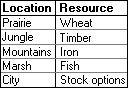

# RULES

## 101 (IMMUTABLE)
All players must always abide by all the rules then in effect, in the form in which they are then in effect. The rules in the Initial Set are in effect whenever a game begins. The Initial Set consists of Rules 101-115 (immutable) and 201-214 (mutable).

## 102 (IMMUTABLE)
Initially rules in the 100's are immutable and rules in the 200's are mutable. Rules subsequently enacted or transmuted (that is, changed from immutable to mutable or vice versa) may be immutable or mutable regardless of their numbers, and rules in the Initial Set may be transmuted regardless of their numbers.
## 103 (IMMUTABLE)

A rule-change is any of the following: (1) the enactment, repeal, or amendment of a mutable rule; (2) the enactment, repeal, or amendment of an amendment of a mutable rule; or (3) the transmutation of an immutable rule into a mutable rule or vice versa.

## 104 (IMMUTABLE)
All rule-changes proposed in the proper way shall be voted on. They will be adopted if and only if they receive the required number of votes.

## 105 (IMMUTABLE)
All proposed rule-changes shall be written down before they are voted on. If they are adopted, they shall guide play in the form in which they were voted on.

## 106 (IMMUTABLE)
No rule-change may take effect earlier than the moment of the completion of the vote that adopted it, even if its wording explicitly states otherwise. No rule-change may have retroactive application.

## 107 (IMMUTABLE)
Each proposed rule-change shall be given a number for reference. The numbers shall begin with 301, and each rule-change proposed in the proper way shall receive the next successive integer, whether or not the proposal is adopted.

## 108 (IMMUTABLE)
Rule-changes that transmute immutable rules into mutable rules may be adopted if and only if the vote is unanimous among the eligible voters. Transmutation shall not be implied, but must be stated explicitly in a proposal to take effect.

## 109 (IMMUTABLE)
In a conflict between a mutable and an immutable rule, the immutable rule takes precedence and the mutable rule shall be entirely void. For the purposes of this rule a proposal to transmute an immutable rule does not "conflict" with that immutable rule.

## 110 (IMMUTABLE)
A player always has the option to forfeit the game rather than continue to play or incur a game penalty. No penalty worse than losing, in the judgment of the player to incur it, may be imposed.

## 111 (IMMUTABLE)
The adoption of rule-changes must never become completely impermissible.

## 112 (IMMUTABLE)
Rule-changes that affect rules needed to allow or apply rule-changes are as permissible as other rule-changes. Even rule-changes that amend or repeal their own authority are permissible. No rule-change or type of move is impermissible solely on account of the self-reference or self-application of a rule.

## 113 (IMMUTABLE)
Votes must be unambiguous. A vote that would be ambiguous is not considered to be a vote. Additional rules may be made to clarify what constitutes ambiguity. 

## 114 (IMMUTABLE)
Server administrators and moderators regulate the server and game. Their responsibilities include the creation of text and voice channels, the designation of which messages go in which channels, the editing or deleting of messages that are inappropriate for the channel that they are in, and keeping track of the state of the game. The server administrator may override the decision of a server moderator, and may grant and revoke moderator status to persons. 

A person is a server administrator if and only if they have the "Administrator" role. A person is a server moderator if and only if they have the "Moderator" role. 

## 115 (IMMUTABLE)
Whatever is not prohibited or regulated by a rule is permitted and unregulated, with the sole exception of changing the rules, which is permitted only when a rule or set of rules explicitly or implicitly permits it.

## 201
Players shall initially alternate in a random order to be determined by the server administrator by the start of the game, taking one whole turn apiece. Players joining the game will have their turn order set to preceed the player that is taking their turn at the time of the player’s joining.  Turns belonging to active players may not be skipped or passed, and parts of turns belonging to active players may not be omitted. All players begin with zero points.

## 202
One turn consists of proposing one rule-change and having it voted on.

## 203
A rule-change is adopted if and only if a simple majority of eligible voters vote for it. 

## 204
An adopted rule-change takes full effect at the moment of the completion of the vote that adopted it.

## 205
Every active player is an eligible voter. Every eligible voter must participate in every vote on rule-changes.

## 206
Active players that have not voted after 36 hours of the start of a vote on a rule-change, that have not made a proposal after 36 hours of the start of their turn, or that have publicly declared that they are no longer active become inactive (i.e. lose their active status). Inactive players that have become inactive through the above methods may become active again by attempting to cast a vote (the vote will be counted as though it was cast when they were active) or by publicly declaring that they are active.

If a player becomes inactive during their turn, their turn ends immediately. If an inactive player's turn would start, their turn is skipped instead.

## 207
Each player always has exactly one vote.

## 208
Players may change or withdraw their votes by stating their intention to do so. Players may not edit or delete their votes (i.e. alter the voting record). A vote that is edited loses its vote status. 

## 209
Proposals may not be edited after they are submitted for voting. A proposal may be resubmitted up to two times a turn. This restarts the vote on the proposal. 

## 210
If two or more mutable rules conflict with one another, or if two or more immutable rules conflict with one another, then the rule with the lowest ordinal number takes precedence.

If at least one of the rules in conflict explicitly says of itself that it defers to another rule (or type of rule) or takes precedence over another rule (or type of rule), then such provisions shall supersede the numerical method for determining precedence.

If two or more rules claim to take precedence over one another or to defer to one another, then the numerical method again governs.

## 211
If players disagree about the legality of a move or the interpretation or application of a rule, then the active player preceding the one moving is to be the Judge and decide the question. Disagreement for the purposes of this rule may be created by the insistence of any player. This process is called invoking Judgment.

When Judgment has been invoked, the next player may not begin his or her turn without the consent of a majority of the other active players.

The Judge's Judgment may be overruled only by either a unanimous vote of the other active players taken before the next turn is begun or the server administrator before the next turn is begun. If a Judge's Judgment is overruled, then the active player preceding the Judge in the playing order becomes the new Judge for the question, and so on, except that no player is to be Judge during his or her own turn or during the turn of a team-mate.

The server administrator can only overrule a Judge’s Judgement if the Judgement egregiously conflicts with the rules and would cause lasting damage to the game. A majority vote of the other active players, taken before the next turn is begun, may nullify the overruling, in which case the original Judgement stands, the original Judge resumes their position as Judge, all Judgements issued by Judges between the overruling and the nullification of the overruling are nullified, and the server administrator is barred from overruling the Judge for the remainder of the turn. 

Unless a Judge is overruled, one Judge settles all questions arising from the game until the next turn is begun, including questions as to his or her own legitimacy and jurisdiction as Judge.

New Judges are not bound by the decisions of old Judges. New Judges may, however, settle only those questions on which the players currently disagree and that affect the completion of the turn in which Judgment was invoked. All decisions by Judges shall be in accordance with all the rules then in effect; but when the rules are silent, inconsistent, or unclear on the point at issue, then the Judge shall consider game-custom and the spirit of the game before applying other standards.

## 212
The state of affairs that constitutes winning may not be altered from achieving n points to any other state of affairs. The magnitude of n and the means of earning points may be changed, and rules that establish a winner when play cannot continue may be enacted and (while they are mutable) be amended or repealed.

## 213
If the rules are changed so that further play is impossible, or if the legality of a move cannot be determined with finality, or if by the Judge's best reasoning, not overruled, a move appears equally legal and illegal, then the first player unable to complete a turn is the winner.

This rule takes precedence over every other rule determining the winner.

## 214
Persons wishing to become players may request to do so publicly. Within 24 hours of the request, if no player has publicly objected or privately objected (to a server moderator or administrator) to a player joining the game, that player will join the game. If a player has objected, a vote is immediately held on whether or not the person joins the game. If there is a majority vote in favor after 24 hours of the start of the vote, that player will join the game.

Persons may not pretend to be multiple players at once. Persons that are found to have done this are banned from the game.

## 301
No more than three (3) players may win the game.  Once any player or group of players wins, the game ends. After the game has ended, no rule changes may be proposed or enacted and no in-game actions may be taken.

## 302
The following are defined as locations:
* Prairie
* Jungle
* Mountains
* Marsh
* City
* Desert

Each player is always in exactly one location. A player may, during their turn, choose to change their location. A player can only perform this action once per turn, and may not use this action to change their location to or from the Desert. Other rules may introduce alternative ways of changing a player's location without coming into conflict with this rule.

Players start out in the City, and their location automatically becomes the City if they do not have any location.

## 304
Each player must create a short bio introducing themselves.

## 305
Players start out with 0 wheat, timber, iron, fish, and stock options. These five values are referred to as "location resources".

Players are either Landowners or not Landowners. A player is a Landowner by default, and loses their Landowner status by having their turn skipped. A player that is not a Landowner regains their Landowner status by gaining location resources via the method described below.

Following the end of their turn, players may choose to gain location resources by rolling 2d6 in the #actions channel. A player that performs this action will then gain either 2 or (X - L) resources, whichever is larger. X is equal to the number that the player rolled, and L is equal to the number of other Landowners in the player's location, unless the player is in the City, in which case L is equal to 0.

Players may roll to gain location resources at any time from the end of their turn to the end of the following turn. Once a player has rolled for a location resource, they cannot roll for a location resource again until another one of their turns has ended.

The location resource that they player gains depends on the location that they are in at the time of their roll. Locations correspond to location resources as follows:

If the location that a player is currently in does not correspond to a location resource, that player will be unable to roll for location resources.

## 306

Players may trade location resources to each other. All aspects of a trade must be public and mutually agreed upon.

A trade may only be performed if both players involved in the trade are in the same location. A player may change their location once every 3 turns.

## 307

Players may choose one profession as an action during their turn. 
Professions are as follows: 
* Blacksmith
* Cook
* Alchemists
* Woodcarver

Players may not exceed one profession. If a player wishes to change professions they must wait a full round past their last pick

#### 307b: Items

Professions have the ability to create items that have a one time effect on the game state. After a use the item is expended and is destroyed. An item may not used on the same turn that it was created. Items may be traded between players if they're on the same location. If an item can be used, any player can be targeted. Items can only be crafted by players of that specific profession.

Blacksmith:
* Axe: Target player rolls an extra d3 when collecting resources if they're in the jungle location. 6 iron and 3 timber create 1.
* Pickaxe: Target player rolls an extra d3 when collecting resources if they're in the mountain location. 6 iron and 3 timber create 1. 

Wood carver:
* Fishing Rod: Target player rolls an extra d3 when collecting resources if they're in the marsh location. 9 timber create 1. 
* Hoe: Target player rolls an extra d3 when collection resources if they're in the prairie location. 9 timber create 1.

Cook
* Bread: Two target players swap locations. 8 wheat and 1 timber create 1. 
* Stew: Move target player to the location of the user's choice. 5 fish and 4 wheat create 1. 

Alchemist
* Fish Oil: Target player takes their turn after this one (that will be their turn for this round). If a player has already taken their during that current round, then the effect is void. 50 fish, 10 wheat, 2 iron, and 2 timber create 1. 
* Gold Flakes: No effect. 5 iron and 3 timber create 1.
* Potion of Cleansing:  All effects are removed from target player. 3 Gold Flakes and 1 Fish Oil create 1.

## 308

* Players may lay claim to territory in a location once they have ended 3 consecutive turns in said location.

* Each player may have only one claim.

* A player loses their claim if they leave their claim's location for more then one turn without having spent the previous four turns at said location.

* Max of 5 claims per location.

* Claimed territory yields and adition d3 die's amount of resources at no cost.

* Claimed territory yields may be upgraded up to 8 times by an additional d3 dice to the yield roll.

* The cost to upgrade a territory is the previous upgrade's cost plus 20 wood, 15 iron, and 15 wheat. 

## 309

* If a bot or part of a bot was written by any player then the source code that runs on this server must be available to other players.

* Bots can not bias one player over the other unless as part of the rules that govern them

* If a rule requires a bot that has not been finished or needs maintenance then the game should ignore that rule. If any part of the rule does not need the bot then those parts should not be ignored. 
